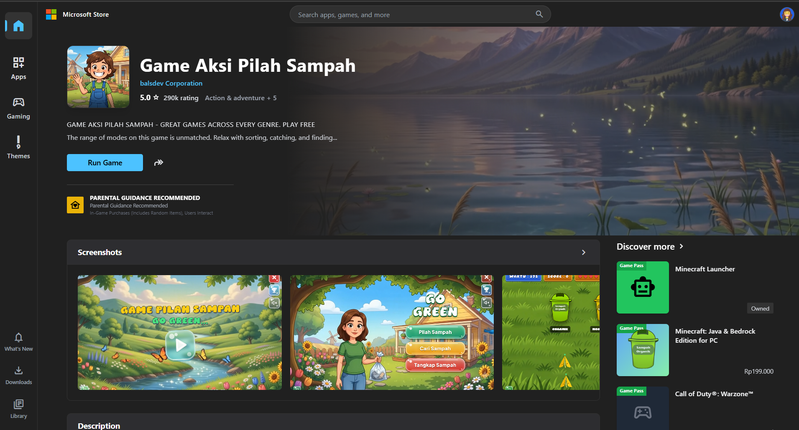

# 🌍 Game Aksi Pilah Sampah



Sebuah permainan edukasi *(educational web-based game)* interaktif yang dirancang khusus untuk mengajarkan pemilahan dan pengolahan sampah demi menjaga kelestarian lingkungan. Game ini dibangun menggunakan teknologi web modern dan didesain agar sangat responsif, imersif, serta mudah dimainkan baik di PC, Laptop, maupun perangkat layar sentuh besar (*Interactive Flat Panel* / Monitor Sentuh).

---

## 🌟 Fitur Utama

- **Tiga Mode Permainan Menarik:**
  1. **Mode Pilah:** Seret dan lepaskan *(Drag and Drop)* sampah organik, anorganik, dan B3 ke tempat sampah yang tepat.
  2. **Mode Cari:** Berlomba berpacu dengan waktu untuk menemukan letak sampah-sampah tersembunyi yang merusak pemandangan di berbagai level lingkungan.
  3. **Mode Tangkap:** Latih ketangkasan Anda untuk menangkap sampah yang berjatuhan dari langit sebelum menyentuh tanah!
- **Dukungan Penuh Layar Sentuh *(Multitouch)*:** Dioptimalkan dengan *Framer Motion* sehingga 10 jari berbeda dapat menggeser sampah yang berbeda secara bersamaan!
- **Sistem *Leaderboard* Terpadu:** Bermain secara berkelompok/tim, raih skor tertinggi, dan pamerkan skor di papan peringkat (*Leaderboard*).
- **Audio Imersif & BGM:** Dilengkapi dengan efek suara aksi interaktif dan *Background Music* yang menenangkan, lengkap dengan tombol bisu (*mute*).
- **Otomatis Layar Penuh (*Fullscreen*):** Transisi yang mulus ke layar penuh untuk pengalaman bermain yang mendalam tanpa gangguan browser.

---

## 🛠️ Teknologi yang Digunakan

Proyek ini dibangun di atas *stack* modern untuk performa maksimal:
- **[React.js](https://react.dev/)** - *Library* UI utama.
- **[Vite](https://vitejs.dev/)** - *Build-tool* super cepat.
- **[Tailwind CSS](https://tailwindcss.com/)** - *Styling* utilitas untuk tata letak (*layout*) responsif dan desain "bubbly" bergaya jelly 3D modern.
- **[Framer Motion](https://www.framer.com/motion/)** - *Engine* fisika dan animasi untuk transisi halaman dan pergerakan memilah sampah (*drag constraint*).
- **Web Audio API** - Mengolah *Sound Effects* dengan latensi nol tanpa gangguan *(no delay)*.

---

## 🚀 Cara Menjalankan Secara Lokal (Local Development)

Jika Anda ingin mencoba, mengembangkan, atau memodifikasi game ini di komputer Anda sendiri, ikuti langkah-langkah berikut:

### Prasyarat
Pastikan Anda sudah menginstal **Node.js** (versi 18.x atau yang lebih baru) di komputer Anda.

### Instalasi & Menjalankan
1. **Clone repositori ini:**
   ```bash
   git clone https://github.com/iqbalgsr46/Game-Aksi-Pilah-Sampah.git
   cd Game-Aksi-Pilah-Sampah
   ```
2. **Instal dependensi/paket yang dibutuhkan:**
   ```bash
   npm install
   ```
3. **Jalankan server pengembangan (Dev Server):**
   ```bash
   npm run dev
   ```
4. Buka *browser* Anda dan kunjungi URL yang tertera di terminal (biasanya `http://localhost:5173`).

---

## 📱 Panduan Mode Lanskap (Khusus Smartphone)

Bagi Anda yang mencoba mengakses *game* ini menggunakan *smartphone*:
- Game ini didesain secara khusus untuk **mode lanskap (mendatar)**.
- Jika diakses dalam mode berdiri (*portrait*), sistem akan secara otomatis memunculkan layar peringatan (*Overlay*) yang mewajibkan Anda untuk memutar HP Anda.
- Hal ini diberlakukan demi menjaga area permainan (*play area*) tetap lega dan tidak merusak koordinat sistem *drag-and-drop*.

---

## 🎓 Penghargaan & Ucapan Terima Kasih

- **Created by:** Tubagus Iqbal Husaeni
- **Instansi:** Universitas Pelita Bangsa

*Terima kasih telah berkontribusi dalam mengedukasi generasi peduli lingkungan melalui game ini! Mari bersama wujudkan Bumi yang bebas dari sampah berbahaya.* 🌿♻️
